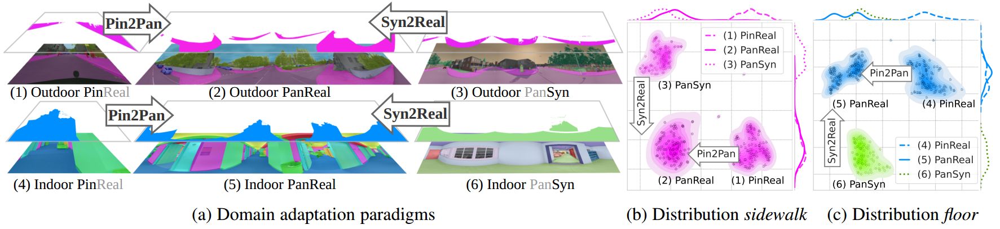
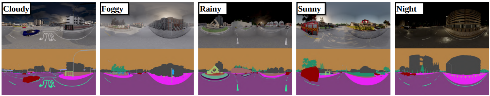

# Transformers for Panoramic Semantic Segmentation (Trans4PASS & Trans4PASS+)

**Bending Reality: Distortion-aware Transformers for Adapting to Panoramic Semantic Segmentation**, CVPR 2022, [[PDF](https://arxiv.org/pdf/2203.01452.pdf)].


**Behind Every Domain There is a Shift: Adapting Distortion-aware Vision Transformers for Panoramic Semantic Segmentation**, arxiv preprint, [[PDF](https://arxiv.org/pdf/2207.11860.pdf)].


[](https://paperswithcode.com/sota/semantic-segmentation-on-densepass?p=behind-every-domain-there-is-a-shift-adapting)

[](https://paperswithcode.com/sota/semantic-segmentation-on-synpass?p=behind-every-domain-there-is-a-shift-adapting)

[](https://paperswithcode.com/sota/semantic-segmentation-on-stanford2d3d-1?p=behind-every-domain-there-is-a-shift-adapting)

[](https://paperswithcode.com/sota/semantic-segmentation-on-cityscapes-val?p=bending-reality-distortion-aware-transformers)

## Update

- [08/2022], a new panoramic semantic segmentation benchmark **SynPASS** is released. 

- [08/2022], Trans4PASS+ is released.


## Environments

```bash
conda create -n trans4pass python=3.8
conda activate trans4pass
cd ~/path/to/trans4pass 
conda install pytorch==1.8.0 torchvision==0.9.0 torchaudio==0.8.0 cudatoolkit=11.1 -c pytorch -c conda-forge
pip install mmcv-full==1.3.9 -f https://download.openmmlab.com/mmcv/dist/cu111/torch1.8.0/index.html
pip install -r requirements.txt
python setup.py develop --user
# Optional: install apex follow: https://github.com/NVIDIA/apex
```

## SynPASS dataset



SynPASS dataset contains **9080** panoramic images (1024x2048) and **22** categories. 

The scenes include cloudy, foggy, rainy, sunny, and day-/night-time conditions. 

***The SynPASS dataset is now availabel at [GoogleDrive](https://drive.google.com/file/d/1u-5J13CD6MXpWB53apB-L6kZ3hK1JR77/view?usp=sharing).***


SynPASS statistic information:

|  | Cloudy | Foggy | Rainy | Sunny | ALL |
|---|:---:|:---:|:---:|:---:|:---:|
| **Split** | train/val/test | train/val/test | train/val/test | train/val/test | train/val/test |
| **#Frames** | 1420/420/430 | 1420/430/420 | 1420/430/420 | 1440/410/420 | 5700/1690/1690 |
| **Split** | day/night | day/night | day/night | day/night | day/night |
| **#Frames** | 1980/290 | 1710/560 | 2040/230 | 1970/300 | 7700/1380 |
| **Total** | 2270 | 2270 | 2270 | 2270 | 9080 |

## Data Preparation

Prepare datasets: 
- [Cityscapes](https://www.cityscapes-dataset.com/)
- [DensePASS](https://github.com/chma1024/DensePASS)
- [SynPASS](https://drive.google.com/file/d/1u-5J13CD6MXpWB53apB-L6kZ3hK1JR77/view?usp=sharing)
- [Stanford2D3D](https://arxiv.org/abs/1702.01105)
- [Structured3D](https://structured3d-dataset.org/)
```
datasets/
├── cityscapes
│   ├── gtFine
│   └── leftImg8bit
├── Stanford2D3D
│   ├── area_1
│   ├── area_2
│   ├── area_3
│   ├── area_4
│   ├── area_5a
│   ├── area_5b
│   └── area_6
├── Structured3D
│   ├── scene_00000
│   ├── ...
│   └── scene_00199
├── SynPASS
│   ├── img
│   │   ├── cloud
│   │   ├── fog
│   │   ├── rain
│   │   └── sun
│   └── semantic
│       ├── cloud
│       ├── fog
│       ├── rain
│       └── sun
├── DensePASS
│   ├── gtFine
│   └── leftImg8bit
```
Prepare pretrained weights, which can be found in the public repository of [SegFormer](https://github.com/NVlabs/SegFormer).
```
pretrained/
├── mit_b1.pth
└── mit_b2.pth
```

## Network Define
The code of Network pipeline is in `segmentron/models/trans4pass.py`.

The code of backbone is in `segmentron/models/backbones/trans4pass.py`.

The code of DMLP decoder is in `segmentron/modules/dmlp.py`.

The code of DMLPv2 decoder is in `segmentron/modules/dmlp2.py`.

## Train
For example, to use 4 1080Ti GPUs to run the experiments:
```bash
# Trans4PASS
python -m torch.distributed.launch --nproc_per_node=4 tools/train_cs.py --config-file configs/cityscapes/trans4pass_tiny_512x512.yaml
python -m torch.distributed.launch --nproc_per_node=4 tools/train_s2d3d.py --config-file configs/stanford2d3d/trans4pass_tiny_1080x1080.yaml
# Trans4PASS+, please modify the version at segmentron/models/trans4pass.py
python -m torch.distributed.launch --nproc_per_node=4 tools/train_cs.py --config-file configs/cityscapes/trans4pass_plus_tiny_512x512.yaml
python -m torch.distributed.launch --nproc_per_node=4 tools/train_sp.py --config-file configs/synpass/trans4pass_plus_tiny_512x512.yaml
python -m torch.distributed.launch --nproc_per_node=4 tools/train_s2d3d.py --config-file configs/stanford2d3d/trans4pass_plus_tiny_1080x1080.yaml
```

## Test
Download the models from [GoogleDrive](https://drive.google.com/drive/folders/1snUdrg_Y9whnCQi9QNFLI6hRoYhGm3Qv?usp=sharing) and save in `./workdirs` folder as:

<details>
<summary> workdirs folder:</summary>

```
./workdirs
├── cityscapes
│   ├── trans4pass_plus_small_512x512
│   ├── trans4pass_plus_tiny_512x512
│   ├── trans4pass_small_512x512
│   └── trans4pass_tiny_512x512
├── cityscapes13
│   ├── trans4pass_plus_small_512x512
│   ├── trans4pass_plus_tiny_512x512
│   ├── trans4pass_small_512x512
│   └── trans4pass_tiny_512x512
├── stanford2d3d
│   ├── trans4pass_plus_small_1080x1080
│   ├── trans4pass_plus_tiny_1080x1080
│   ├── trans4pass_small_1080x1080
│   └── trans4pass_tiny_1080x1080
├── stanford2d3d8
│   ├── trans4pass_plus_small_1080x1080
│   ├── trans4pass_plus_tiny_1080x1080
│   ├── trans4pass_small_1080x1080
│   └── trans4pass_tiny_1080x1080
├── stanford2d3d_pan
│   ├── trans4pass_plus_small_1080x1080
│   ├── trans4pass_small_1080x1080
│   └── trans4pass_tiny_1080x1080
├── structured3d8
│   ├── trans4pass_plus_small_512x512
│   ├── trans4pass_plus_tiny_512x512
│   ├── trans4pass_small_512x512
│   └── trans4pass_tiny_512x512
├── synpass
│   ├── trans4pass_plus_small_512x512
│   ├── trans4pass_plus_tiny_512x512
│   ├── trans4pass_small_512x512
│   └── trans4pass_tiny_512x512
└── synpass13
    ├── trans4pass_plus_small_512x512
    ├── trans4pass_plus_tiny_512x512
    ├── trans4pass_small_512x512
    └── trans4pass_tiny_512x512
```
</details>

Some test examples:

```bash
# Trans4PASS
python tools/eval.py --config-file configs/cityscapes/trans4pass_tiny_512x512.yaml
python tools/eval_s2d3d.py --config-file configs/stanford2d3d/trans4pass_tiny_1080x1080.yaml
# Trans4PASS+
python tools/eval.py --config-file configs/cityscapes/trans4pass_plus_tiny_512x512.yaml
python tools/eval_sp.py --config-file configs/synpass/trans4pass_plus_tiny_512x512.yaml
python tools/eval_dp13.py --config-file configs/synpass13/trans4pass_plus_tiny_512x512.yaml
python tools/eval_s2d3d.py --config-file configs/stanford2d3d/trans4pass_plus_tiny_1080x1080.yaml
```

### Trans4PASS models CS -> DP:
from Cityscapes to DensePASS

```bash
python tools/eval.py --config-file configs/cityscapes/trans4pass_plus_tiny_512x512.yaml
```

| **Network**     | **CS** |   **DP** | Download |
| :-------------- | :-------: | :---------: | :-------------: |
| Trans4PASS (T)  |   72.49 | 45.89 | [model](https://drive.google.com/drive/folders/1kptkc1ltIRSu_9mo0-Cjah_-yLCI9uFK?usp=sharing) |
| Trans4PASS (S)  | 72.84  | 51.38 | [model](https://drive.google.com/drive/folders/1a7Coa1Vct3NzURkKFGZ3BGO-f54af84L?usp=sharing) |
| Trans4PASS+ (T) | 72.67  | 50.23 | [model](https://drive.google.com/drive/folders/1MUrNXVdKNGghVQ567ZyLnDZUXn6uxkXr?usp=sharing) |
| Trans4PASS+ (S) | 75.24 | 51.41 | [model](https://drive.google.com/drive/folders/12lI9EPo8FD2kjhw-M6nLaaEoxHmByvIS?usp=sharing) |

### Trans4PASS models SPin -> SPan:
from Stanford2D3D_pinhole to Stanford2D3D_panoramic

```bash
python tools/eval_s2d3d.py --config-file configs/stanford2d3d/trans4pass_plus_tiny_1080x1080.yaml
```

| **Network**     | **SPin** |   **SPan** | Download |
| :-------------- | :-------: | :---------: | :-------------: |
| Trans4PASS (T)  |   49.05 | 46.08 | [model](https://drive.google.com/drive/folders/1lfes7iqV1Vm_snScBohuKOYvgpeBpq4F?usp=sharing) |
| Trans4PASS (S)  |   50.20 | 48.34 | [model](https://drive.google.com/drive/folders/1ONymWDP7-zC3yt5wG7xoRkhDp1Bt0opW?usp=sharing) |
| Trans4PASS+ (T) |   48.99 | 46.75 | [model](https://drive.google.com/drive/folders/1Ru_V_02btr79eM3dwvaBHECECncuGuMM?usp=sharing) |
| Trans4PASS+ (S) |   53.46 | 50.35 | [model](https://drive.google.com/drive/folders/1vuEQ2vQp3D9n7XvA9k8HeRGN5UFqtMJp?usp=sharing) |


### Trans4PASS models on SPan:
supervised trained on Stanford2D3D_panoramic

```bash
# modify fold id at segmentron/data/dataloader/stanford2d3d_pan.py
# modify TEST_MODEL_PATH at configs/stanford2d3d_pan/trans4pass_plus_small_1080x1080.yaml
python tools/eval_s2d3d.py --config-file configs/stanford2d3d_pan/trans4pass_plus_tiny_1080x1080.yaml
```

| **Network**     | **Fold** |   **SPan** | Download |
| :-------------- | :-------: | :---------: | :-------------: |
| Trans4PASS+ (S) |   1 | 54.05 | [model](https://drive.google.com/drive/folders/14YXmPBXc8m-XR7W_LyKwiDotrjyjSKfH?usp=sharing) |
| Trans4PASS+ (S) |   2 | 47.70 | [model](https://drive.google.com/drive/folders/14YXmPBXc8m-XR7W_LyKwiDotrjyjSKfH?usp=sharing) |
| Trans4PASS+ (S) |   3 | 60.25 | [model](https://drive.google.com/drive/folders/14YXmPBXc8m-XR7W_LyKwiDotrjyjSKfH?usp=sharing) |
| Trans4PASS+ (S) | avg | 54.00 |  |

*Note: for the Trans4PASS versions (not Trans4PASS+), please modify the respective DMLP version, check [here](https://github.com/jamycheung/Trans4PASS/blob/main/segmentron/models/trans4pass.py#L5-L8).*

### Trans4PASS models on SP:
supervised trained on SynPASS

```bash
python tools/eval_sp.py --config-file configs/synpass/trans4pass_plus_tiny_512x512.yaml
```

| **Network**   | **Cloudy** | **Foggy**  | **Rainy**  | **Sunny**  |  **Day**   | **Night**  | **ALL (val)** | **ALL (test)** | Download |
| :------------------ | :--------: | :--------: | :--------: | :--------: | :--------: | :--------: | :-----------: | :------------: | :-----: |
| Trans4PASS (T)   |   46.90   |   41.97   |   41.61   |   45.52   |   44.48   |   34.73   |    43.68     |     38.53     | [model](https://drive.google.com/drive/folders/1Xwn1d0VA3legdq_eANA2QrNFk8fmoD5n?usp=sharing) |
| Trans4PASS (S)  |   46.74   |   43.49   |   43.39   |   45.94   |   45.52   |   37.03   |    44.80     |     38.57     | [model](https://drive.google.com/drive/folders/14qm6uWAgQrxI-doIoVgfV7is1pS03iZE?usp=sharing) |
| Trans4PASS+ (T)  |   48.33   |   43.41   |   43.11   |   46.99   |   46.52   |   35.27   |    45.21     |     38.85     | [model](https://drive.google.com/drive/folders/1C6b056J1yUH4srmQ1LlulDUZIdYpb237?usp=sharing) |
| Trans4PASS+ (S) | 48.87 | 44.80 | 45.24 | 47.62 | 47.17 | 37.96 |  46.47   |   39.16   | [model](https://drive.google.com/drive/folders/1rrqa4nBmgGT0vO3b5duLYNKESX2JbhvT?usp=sharing) |


### Trans4PASS models Pin2Pan vs. Syn2Real settings:

- (1) Indoor Pin2Pan: SPin8 -> SPan8
- (2) Indoor Syn2Real: S3D8 -> SPan8
- (3) Outdoor Pin2Pan: CS13 -> DP13
- (4) Outdoor Syn2Real: SP13 -> DP13

```bash
python tools/eval_dp13.py --config-file configs/synpass13/trans4pass_plus_tiny_512x512.yaml
python tools/eval_dp13.py --config-file configs/cityscaps13/trans4pass_plus_tiny_512x512.yaml
python tools/eval_s2d3d8.py --config-file configs/structured3d8/trans4pass_plus_tiny_512x512.yaml
python tools/eval_s2d3d8.py --config-file configs/stanford2d3d8/trans4pass_plus_tiny_512x512.yaml
```

| (1) ***Outdoor Pin2Pan*:**  | **CS13**  | **DP13**     | **mIoU Gaps** | **model** |
| :------------------------ | :-------- | :----------- | :------------ | ------------- |
| Trans4PASS (Tiny)         | 71.63    | 49.21 | -22.42       | [model](https://drive.google.com/drive/folders/1LhJmprHcTn8zsNMTlscQj9Gx3pT7l7TM?usp=sharing) |
| Trans4PASS (Small)        | 75.21    | 50.96 | -24.25       | [model](https://drive.google.com/drive/folders/1X3tcC9JnqcyKX3Zz0q7sGCZ5rd8Xenm6?usp=sharing) |
| Trans4PASS+ (Tiny)        | 72.92    | 49.16 | -23.76       | [model](https://drive.google.com/drive/folders/1DxkTkz7b5gWhbj_J7ljEWgTQTSUEObgO?usp=sharing) |
| Trans4PASS+ (Small)       | 74.52    | 51.40 | -23.12       | [model](https://drive.google.com/drive/folders/1pVSraZXub9RnQjM-vDMK_nnQtKpQ3_xT?usp=sharing) |
| (2) ***Outdoor Syn2Real*:** | **SP13**  | **DP13**     | **mIoU Gaps** |  |
| Trans4PASS (Tiny)         | 61.08    | 39.68 | -21.40       | [model](https://drive.google.com/drive/folders/1pVSraZXub9RnQjM-vDMK_nnQtKpQ3_xT?usp=sharing) |
| Trans4PASS (Small)        | 62.76    | 43.18 | -19.58       | [model](https://drive.google.com/drive/folders/1ASqH2MmjdzN2I-gVE5ihmFQ7eXj5iSQj?usp=sharing) |
| Trans4PASS+ (Tiny)        | 60.37    | 39.62 | -20.75       | [model](https://drive.google.com/drive/folders/1y5JTty7PpGVCuuADOM8z4gvENWcB02Kr?usp=sharing) |
| Trans4PASS+ (Small)       | 61.59    | 43.17 | -18.42       | [model](https://drive.google.com/drive/folders/1u1gieYZ6N-mxXR3TiIjyVjY9aY1oY2Qo?usp=sharing) |
| (3) ***Indoor Pin2Pan*:**   | **SPin8** | **SPan8**    | **mIoU Gaps** |  |
| Trans4PASS (Tiny)         | 64.25    | 58.93 | -5.32        | [model](https://drive.google.com/drive/folders/1SQHy2cjcFagt4Fe1PGKV41EZ4YVzkY0O?usp=sharing) |
| Trans4PASS (Small)        | 66.51    | 62.39 | -4.12        | [model](https://drive.google.com/drive/folders/174IvfmClJUE-idmrzyy8NlApxTOZHHOo?usp=sharing) |
| Trans4PASS+ (Tiny)        | 65.09    | 59.55 | -5.54        | [model](https://drive.google.com/drive/folders/1Nikm73tGyIyvrzyB4bcI2WWe1bYO6Q8-?usp=sharing) |
| Trans4PASS+ (Small)       | 65.29    | 63.08 | -2.21        | [model](https://drive.google.com/drive/folders/1PxKuHgYY3m-lQ0lkkAFSzHcvjwB6H8z7?usp=sharing) |
| (4) ***Indoor Syn2Real*:**  | **S3D8**  | **SPan8**    | **mIoU Gaps** |  |
| Trans4PASS (Tiny)         | 76.84    | 48.63 | -28.21       | [model](https://drive.google.com/drive/folders/12mNdqVZ8I92O4rrlpqAntyIqIpBZ3IaP?usp=sharing) |
| Trans4PASS (Small)        | 77.29    | 51.70 | -25.59       | [model](https://drive.google.com/drive/folders/1vwSA_Q308WIc-u-eHtt-YFmZzrM-nN7Z?usp=sharing) |
| Trans4PASS+ (Tiny)        | 76.91    | 50.60 | -26.31       | [model](https://drive.google.com/drive/folders/1_PGhg0PYRxjXiQ82APSzCjkRRZPay-PE?usp=sharing) |
| Trans4PASS+ (Small)       | 76.88    | 51.93 | -24.95       | [model](https://drive.google.com/drive/folders/1Z7wuGjmQVAbZKP5UEtPmIlN3OeMuiTls?usp=sharing) |


## Domain Adaptation

### Train
After the model is trained on the source domain, the model can be further trained by the adversarial method for warm-up in the target domain. 

```
cd adaptations
python train_warm.py
```

Then, use the warm up model to generate the pseudo label of the target damain.
```
python gen_pseudo_label.py
```

The proposed MPA method can be jointly used for perform domain adaptation.
```
# (optional) python train_ssl.py
python train_mpa.py
```

Domain adaptation with Trans4PASS+, for example, adapting model trained from pinhole to panoramic, i.e., from Cityscapes13 to DensePASS13 (CS13 -> DP13):
```bash
python train_warm_out_p2p.py
python train_mpa_out_p2p.py
```


### Test
Download the models from [GoogleDrive](https://drive.google.com/drive/folders/1snUdrg_Y9whnCQi9QNFLI6hRoYhGm3Qv?usp=sharing) and save in `adaptations/snapshots` folder as:

```
adaptations/snapshots/
├── CS2DensePASS_Trans4PASS_v1_MPA
│   └── BestCS2DensePASS_G.pth
├── CS2DensePASS_Trans4PASS_v2_MPA
│   └── BestCS2DensePASS_G.pth
├── CS132CS132DP13_Trans4PASS_plus_v2_MPA
│   └── BestCS132DP13_G.pth
├── CS2DP_Trans4PASS_plus_v1_MPA
│   └── BestCS2DensePASS_G.pth
└── CS2DP_Trans4PASS_plus_v2_MPA
    └── BestCS2DensePASS_G.pth
```

Change the `RESTORE_FROM` in `evaluate.py` file.
Or change the `scales` in `evaluate.py` for multi-scale evaluation.

```bash
# Trans4PASS
cd adaptations
python evaluate.py
# Trans4PASS+, CS132DP13
python evaluate_out13.py
```


## References
We appreciate the previous open-source works.
* [Segmentron](https://github.com/LikeLy-Journey/SegmenTron)
* [SegFormer](https://github.com/NVlabs/SegFormer)
* [mmsegmentation](https://github.com/open-mmlab/mmsegmentation)

## License

This repository is under the Apache-2.0 license. For commercial use, please contact with the authors.


## Citations

If you are interested in this work, please cite the following works:

Trans4PASS+ [[**PDF**](https://arxiv.org/pdf/2207.11860.pdf)]
```
@article{zhang2022behind,
  title={Behind Every Domain There is a Shift: Adapting Distortion-aware Vision Transformers for Panoramic Semantic Segmentation},
  author={Zhang, Jiaming and Yang, Kailun and Shi, Hao and Rei{\ss}, Simon and Peng, Kunyu and Ma, Chaoxiang and Fu, Haodong and Wang, Kaiwei and Stiefelhagen, Rainer},
  journal={arXiv preprint arXiv:2207.11860},
  year={2022}
}
```

Trans4PASS [[**PDF**](https://arxiv.org/pdf/2203.01452.pdf)]
```
@inproceedings{zhang2022bending,
  title={Bending Reality: Distortion-aware Transformers for Adapting to Panoramic Semantic Segmentation},
  author={Zhang, Jiaming and Yang, Kailun and Ma, Chaoxiang and Rei{\ss}, Simon and Peng, Kunyu and Stiefelhagen, Rainer},
  booktitle={2022 IEEE/CVF Conference on Computer Vision and Pattern Recognition (CVPR)},
  pages={16917--16927},
  year={2022}
}
```
