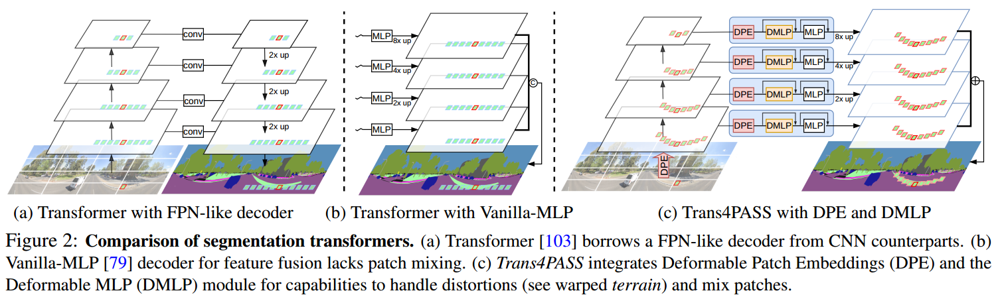

# Trans4PASS
**Bending Reality: Distortion-aware Transformers for Adapting to Panoramic Semantic Segmentation**



[](https://paperswithcode.com/sota/semantic-segmentation-on-densepass?p=behind-every-domain-there-is-a-shift-adapting)

[](https://paperswithcode.com/sota/semantic-segmentation-on-synpass?p=behind-every-domain-there-is-a-shift-adapting)

[](https://paperswithcode.com/sota/semantic-segmentation-on-stanford2d3d-1?p=behind-every-domain-there-is-a-shift-adapting)

[](https://paperswithcode.com/sota/semantic-segmentation-on-cityscapes-val?p=bending-reality-distortion-aware-transformers)

### Introduction

To get around this domain difference and bring together semantic annotations from pinhole- and 360◦ surround-visuals, we propose to learn object deformations and panoramic image distortions in the Deformable Patch Embedding (DPE) and Deformable MLP (DMLP) components which blend into our Transformer for PAnoramic Semantic Segmentation (Trans4PASS) model.

More detailed can be found in our [arxiv](https://arxiv.org/pdf/2203.01452.pdf) paper.

## Environments

```bash
conda create -n trans4pass python=3.8
conda activate trans4pass
cd ~/path/to/trans4pass 
conda install pytorch==1.8.0 torchvision==0.9.0 torchaudio==0.8.0 cudatoolkit=11.1 -c pytorch -c conda-forge
pip install mmcv-full==1.3.9 -f https://download.openmmlab.com/mmcv/dist/cu111/torch1.8.0/index.html
pip install -r requirements.txt
python setup.py develop --user
# Optional: install apex follow: https://github.com/NVIDIA/apex
```

## Data Preparation

Prepare datasets: [Cityscapes](https://www.cityscapes-dataset.com/), [Stanford2D3D](https://arxiv.org/abs/1702.01105), [DensePASS](https://github.com/chma1024/DensePASS).
```
datasets/
├── cityscapes
│   ├── gtFine
│   └── leftImg8bit
├── Stanford2D3D
│   ├── area_1
│   ├── area_2
│   ├── area_3
│   ├── area_4
│   ├── area_5a
│   ├── area_5b
│   └── area_6
├── DensePASS
│   ├── gtFine
│   └── leftImg8bit
```
Prepare pretrained weights, which can be found in the public repository of [SegFormer](https://github.com/NVlabs/SegFormer).
```
pretrained/
├── mit_b1.pth
└── mit_b2.pth
```

## Network Define
The code of Network pipeline is in `segmentron/models/trans4pass.py`.

The code of backbone is in `segmentron/models/backbones/trans4pass.py`.

The code of DMLP decoder is in `segmentron/modules/dmlp.py`.

## Train
Our experiments are based on one machine with 4 1080Ti GPUs.

For example:
```
python -m torch.distributed.launch --nproc_per_node=4 tools/train.py --config-file configs/cityscapes/trans4pass_tiny_512x512.yaml
python -m torch.distributed.launch --nproc_per_node=4 tools/train_s2d3d.py --config-file configs/stanford2d3d/trans4pass_tiny_1080x1080.yaml
```

## Test
Download the models from [GoogleDrive](https://drive.google.com/drive/folders/1snUdrg_Y9whnCQi9QNFLI6hRoYhGm3Qv?usp=sharing) and save in `workdirs` folder as:

```
├── workdirs
│   ├── cityscapes
│   │   ├── trans4pass_small_512x512
│   │   │   └── trans4pass_small_512x512.pth
│   │   └── trans4pass_tiny_512x512
│   │       └── trans4pass_tiny_512x512.pth
│   └── stanford2d3d
│   │   ├── trans4pass_small_1080x1080
│   │   │   └── trans4pass_small_1080x1080.pth
│   │   └── trans4pass_tiny_1080x1080
│   │       └── trans4pass_tiny_1080x1080.pth
│   └── stanford2d3d_pan
│       ├── trans4pass_small_1080x1080
│       │   └── trans4pass_small_pan_F1.pth
│       └── trans4pass_tiny_1080x1080
│           └── trans4pass_tiny_pan_F1.pth
```

```
python tools/eval.py --config-file configs/cityscapes/trans4pass_tiny_512x512.yaml
python tools/eval_stanford.py --config-file configs/stanford2d3d/trans4pass_tiny_1080x1080.yaml
```

## Domain Adaptation

### Train
After the model is trained on the source domain, the model can be further trained by the adversarial method for warm-up in the target domain. 

```
cd adaptations
python train_warm.py
```

Then, use the warm up model to generate the pseudo label of the target damain.
```
python gen_pseudo_label.py
```

The proposed MPA method can be jointly used for perform domain adaptation.
```
# (optional) python train_ssl.py
python train_mpa.py
```

### Test
Download the models from [GoogleDrive](https://drive.google.com/drive/folders/1snUdrg_Y9whnCQi9QNFLI6hRoYhGm3Qv?usp=sharing) and save in `adaptations/snapshots` folder as:

```
adaptations/snapshots/
├── CS2DensePASS_Trans4PASS_v1_MPA
│   └── BestCS2DensePASS_G.pth
├── CS2DensePASS_Trans4PASS_v2_MPA
│   └── BestCS2DensePASS_G.pth
```

Change the `RESTORE_FROM` in `evaluate.py` file.
Or change the `scales` in `evaluate.py` for multi-scale evaluation.

```
cd adaptations
python evaluate.py
```


## References
We appreciate the previous open-source works.
* [Segmentron](https://github.com/LikeLy-Journey/SegmenTron)
* [SegFormer](https://github.com/NVlabs/SegFormer)
* [mmsegmentation](https://github.com/open-mmlab/mmsegmentation)

## License

This repository is under the Apache-2.0 license. For commercial use, please contact with the authors.


## Citations

If you are interested in this work, please cite the following works:

Trans4PASS+ [[**PDF**](https://arxiv.org/pdf/2207.11860.pdf)]
```text
@article{zhang2022behind,
  title={Behind Every Domain There is a Shift: Adapting Distortion-aware Vision Transformers for Panoramic Semantic Segmentation},
  author={Zhang, Jiaming and Yang, Kailun and Shi, Hao and Rei{\ss}, Simon and Peng, Kunyu and Ma, Chaoxiang and Fu, Haodong and Wang, Kaiwei and Stiefelhagen, Rainer},
  journal={arXiv preprint arXiv:2207.11860},
  year={2022}
}
```

Trans4PASS [[**PDF**](https://arxiv.org/pdf/2203.01452.pdf)]
```text
@inproceedings{zhang2022bending,
  title={Bending Reality: Distortion-aware Transformers for Adapting to Panoramic Semantic Segmentation},
  author={Zhang, Jiaming and Yang, Kailun and Ma, Chaoxiang and Rei{\ss}, Simon and Peng, Kunyu and Stiefelhagen, Rainer},
  booktitle={2022 IEEE/CVF Conference on Computer Vision and Pattern Recognition (CVPR)},
  pages={16917--16927},
  year={2022}
}
```
